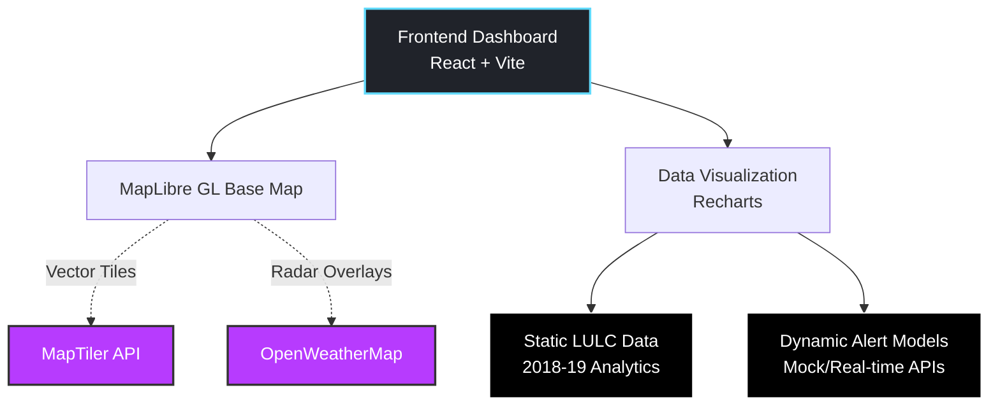
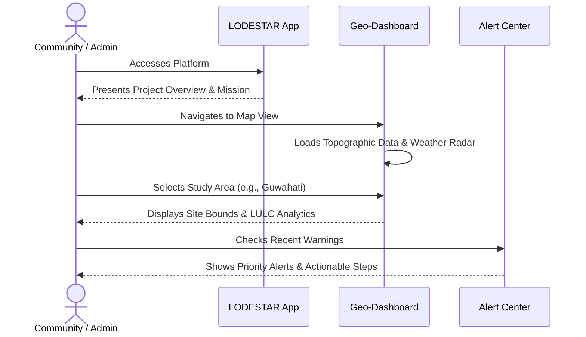

<div align="center">
  
  &nbsp;&nbsp;&nbsp;&nbsp;&nbsp;&nbsp;&nbsp;&nbsp;
  
  
  # 🌐 LODESTAR Frontend Dashboard
  
  **Low-cost Disaster & Emergency Services for Communities At Risk**

  <p align="center">
    <a href="https://dheerajpapani.github.io/lodestar-dashboard/"><strong>Explore the Live Dashboard »</strong></a>
  </p>

  <p align="center">
    
    
    
    
  </p>
</div>

---

## 📖 About The Project

LODESTAR is a collaborative India-Netherlands research initiative designed to co-create a **low-cost, multi-hazard early warning system (MH-EWS)** for floods and droughts. This repository contains the source code for the project's primary visual interface: a modern, highly responsive frontend dashboard.

The dashboard's core mission is to bridge the critical **"know-do gap"** in disaster management. It achieves this by transforming complex scientific meteorological data, real-time alerts, and hydrological models into a clear, actionable format. 

> 💡 **Philosophy of Co-creation**: The entire application integrates advanced technology (AI/ML workflows, remote sensing) with a bottom-up, community-focused approach through "Living Labs" and "Citizen Science".

---

## ✨ Core Features

| Feature | Description |
| --- | --- |
| 🗺️ **Interactive Geo-Dashboard** | A central 3D map engine built with **MapLibre GL** for visualizing international study sites, complete with interactive weather radar overlays. |
| 📊 **LULC Analytics Engine** | Instantly visualize 2018-19 Land Use / Land Cover (LULC 250K) statistics for critical Indian sites, providing immediate ecological context. |
| 🔔 **Dynamic Alert Center** | An interactive interface for viewing real-time, multi-hazard early warnings. Each alert features clear severity indicators and actionable community recommendations. |
| 🌗 **Persistent Theming** | A polished light/dark mode ecosystem featuring a custom celestial animation that remembers user hardware preferences automatically. |
| 📱 **Liquid Layout Design** | True responsiveness. The dashboard dynamically reflows and scales to provide a flawless experience on 4k monitors, tablets, and mobile devices alike. |
| ⚡ **Lightning Fast** | Powered by Vite, React, and offline-first JSON architecture. No loading spinners, no API limits — just instant data access. |
| 🌉 **SFTP Bridge Service** | Custom Express.js backend acting as a secure, real-time proxy to internal SFTPGo servers without exposing credentials. |
| 📂 **Internal File Explorer** | A native, React-driven portal with automatic sorting, Grid/List view toggles, and live connection health monitoring. |

---

## 🏗️ System Architecture

The LODESTAR dashboard follows a client-side architecture that fetches both live mapping data and pre-processed analytical datasets.



---

## 🚦 Core User Journey



---

## 🛠️ Technology Stack

This dashboard is engineered with a curated selection of modern, high-performance web technologies:

- **Core:** [React v18](https://reactjs.org/) + [Vite](https://vitejs.dev/)
- **Routing:** [React Router v7](https://reactrouter.com/) (Client-Side Traversal)
- **Geospatial:** [MapLibre GL JS](https://maplibre.org/)
- **Visualization:** [Recharts](https://recharts.org/) (Data & Graphs)
- **Animation:** [Framer Motion](https://www.framer.com/motion/) (Physics-based UI feedback)
- **Styling:** Modular CSS Variables + Tailwind Utility alignment

---

## 🚀 Getting Started

Follow these instructions to get a local development copy up and running seamlessly.

### Prerequisites
* Node.js (v18 or later recommended)
* NPM or Yarn

### Installation

1. **Clone the repository:**
   ```bash
   git clone https://github.com/dheerajpapani/lodestar-dashboard.git
   ```

2. **Navigate into the frontend workspace:**
   ```bash
   cd lodestar-dashboard/frontend
   ```

3. **Install dependencies:**
   ```bash
   npm install
   ```

4. **Environment Variables:**
   Create a `.env` file in the `frontend` directory with your required provider keys:
   ```env
   VITE_OPENWEATHERMAP_KEY=your_openweathermap_api_key
   VITE_MAPTILER_KEY=your_maptiler_api_key
   ```
   *(Note: Core dashboard features, including LULC statistics, are designed to work entirely offline and do not require external API keys to function during evaluation.)*

5. **Start the development server:**
   ```bash
   npm run dev
   ```
   *Dashboard will be locally available at `http://localhost:5173`*

---

## 🚢 Deployment Architecture

This project is configured for zero-downtime static deployment to **GitHub Pages**. 

To deploy a new version to production:
```bash
# From the /frontend directory:
npm run deploy
```
*This command safely executes `vite build` to optimize assets, chunk the application, and seamlessly pushes the `dist` artifacts to the `gh-pages` branch.*

---

## 🔒 Internal Portal

The web application includes an **Internal Portal** navigation route designed for administrative access to LODESTAR's backend data modeling services.

<details>
<summary><strong>View Access Requirements</strong></summary>

> ⚠️ **Access Restriction:** The internal portal is restricted to authorized researchers and requires an active, authenticated **VPN** connection. 
>
> **Major Implementations:**
> - **Secure Proxy**: An Express backend brokers all SFTP requests to protect internal IPs.
> - **UX Polish**: Includes a "Ghost Popup" for real-time connection status (Yellow/Green/Red) and VPN login assistance.
> - **Dynamic Sorting**: Intelligent file explorer logic that prioritizes directories and alphabetical organization.

</details>

---

## 🗂️ Repository Structure

A quick overview of the directory architecture:

```text
lodestar-dashboard/
├── backend/                 # (API & Services)
│   ├── server.js            # Node.js SFTP Bridge Proxy
│   └── package.json         # Backend dependencies & start scripts
├── frontend/                # React Dashboard Application
│   ├── public/              # Static assets (favicons, logos)
│   ├── src/                 
│   │   ├── components/      # Reusable React components (Navbar, AlertCards, etc.)
│   │   ├── data/            # Static JSON datasets (LULC baseline data)
│   │   ├── pages/           # Core page views (Home, Maps, About, Alerts)
│   │   ├── App.jsx          # Main application router
│   │   └── App.css          # Global CSS variables and styling
│   ├── index.html           # HTML entry point
│   ├── vite.config.js       # Vite build configuration
│   └── package.json         # Dependencies and deployment scripts
└── README.md
```

---

## ❓ Troubleshooting & FAQs

<details>
<summary><strong>Map tiles are rendering as blank/grey boxes</strong></summary>

Ensure your `VITE_MAPTILER_KEY` in the `.env` file is correct, valid, and hasn't exceeded its free tier limits for the month. The application will attempt to fallback to public MapLibre tiles, but certain detailed layers require the MapTiler key.
</details>

<details>
<summary><strong>Build is failing due to "chunk size" warnings</strong></summary>

Warnings like `Some chunks are larger than 500 kB` are purely informational from Vite regarding optimization. They **do not** break the build or the deployment. The Github Pages deploy will still succeed.
</details>

<details>
<summary><strong>Cannot access the "Internal Portal"</strong></summary>

As noted above, the internal portal route strictly requires an active IITG VPN connection. If you are a guest or evaluator, this is expected behavior.
</details>

---

## 🤝 Contributing

We welcome feedback, issue reports, and pull requests from partners and researchers.

1. **Fork the Project**
2. **Create a Feature Branch** (`git checkout -b feature/AmazingFeature`)
3. **Commit your Changes** (`git commit -m 'Add some AmazingFeature'`)
4. **Push to the Branch** (`git push origin feature/AmazingFeature`)
5. **Open a Pull Request**

---

## ❤️ Acknowledgments

This platform was developed under **IIT Tirupati Work Stream 4 (WS-4)** as part of the visual culmination of the LODESTAR initiative. It is proudly funded and supported by:

* 🇮🇳 **Department of Science and Technology (DST)**, Government of India
* 🇳🇱 **Dutch Research Council (NWO)**, The Netherlands

---

## 👤 Architecture & Development

Designed, engineered, and maintained under **IIT Tirupati WS-4** by:

**Dheeraj Papani** <br>
*Architect & Lead Developer*

<a href="https://github.com/dheerajpapani">
  
</a>
<a href="https://www.linkedin.com/in/dheeraj-papani-507693274/">
  
</a>
<a href="mailto:dheerajpapani@gmail.com">
  
</a>
